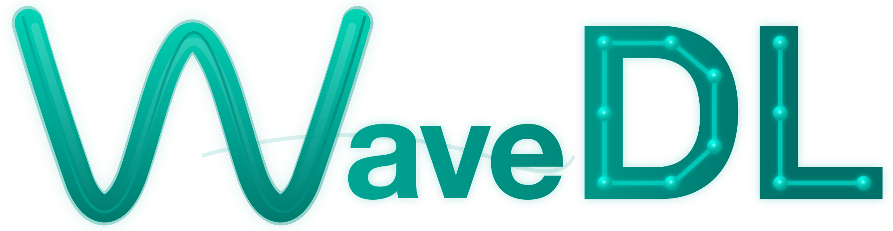
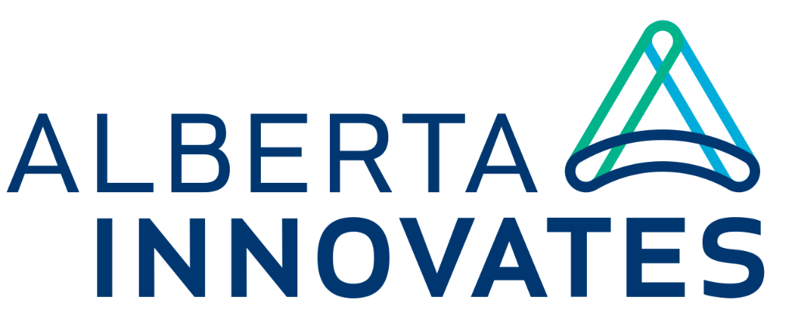

<div align="center">



### A Scalable Deep Learning Framework for Regression Problems in Ultrasonic Non-Destructive Evaluation

[](https://www.python.org/downloads/)
[](https://pytorch.org/)
[](LICENSE)
[](https://huggingface.co/docs/accelerate/)

**Production-ready • Multi-GPU DDP • Memory-Efficient • Plug-and-Play**

[Getting Started](#-getting-started) •
[Documentation](#-documentation) •
[Examples](#-examples) •
[Citation](#-citation)

---

 **Plug in your model, load your data, and let WaveDL do the heavy lifting 💪**

</div>

---

## 💡 What is WaveDL?

WaveDL is a **deep learning framework** built for **regression problems in Ultrasonic Non-Destructive Evaluation (NDE) and Structural Health Monitoring (SHM)**. It provides a robust, scalable training pipeline for mapping multi-dimensional data (1D/2D/3D) to physical quantities.

```
Input: Waveforms, spectrograms, B-scans, dispersion curves, ...
   ↓
Output: Material properties, defect dimensions, damage locations, ...
```

The framework handles the engineering challenges of large-scale deep learning — big datasets, distributed training, and HPC deployment — so you can focus on the science, not the infrastructure.

**Built for researchers who need:**
- 📊 Multi-target regression with reproducibility and fair benchmarking
- 🚀 Seamless multi-GPU training on HPC clusters
- 💾 Memory-efficient handling of large-scale datasets
- 🔧 Easy integration of custom model architectures

---

## ✨ Features

<table width="100%">
<tr>
<td width="50%" valign="top">

**⚡ Load All Data — No More Bottleneck**

Train on datasets larger than RAM:
- Memory-mapped, zero-copy streaming
- Full random shuffling at GPU speed
- Your GPU stays fed — always

</td>
<td width="50%" valign="top">

**🧠 One-Line Model Registration**

Plug in any architecture:
```python
@register_model("my_net")
class MyNet(BaseModel): ...
```
Design your model. Register with one line.

</td>
</tr>
<tr>
<td width="50%" valign="top">

**🛡️ DDP That Actually Works**

Multi-GPU training without the pain:
- Synchronized early stopping
- Deadlock-free checkpointing
- Correct metric aggregation

</td>
<td width="50%" valign="top">

**📊 Publish-Ready Output**

Results go straight to your paper:
- MAE in physical units
- Per-parameter breakdown
- Auto-generated scatter plots

</td>
</tr>
<tr>
<td width="50%" valign="top">

**🖥️ HPC-Native Design**

Built for high-performance clusters:
- Automatic GPU detection
- WandB experiment tracking
- BF16/FP16 mixed precision

</td>
<td width="50%" valign="top">

**🔄 Crash-Proof Training**

Never lose your progress:
- Full state checkpoints
- Resume from any point
- Emergency saves on interrupt

</td>
</tr>
<tr>
<td width="50%" valign="top">

**🎛️ Flexible & Reproducible Training**

Fully configurable via CLI flags or YAML:
- Loss functions, optimizers, schedulers
- K-fold cross-validation
- See [Configuration](#️-configuration) for details

</td>
<td width="50%" valign="top">

**📦 ONNX Export**

Deploy models anywhere:
- One-command export to ONNX
- LabVIEW, MATLAB, C++ compatible
- Validated PyTorch↔ONNX outputs

</td>
</tr>
</table>

---

## 🚀 Getting Started

### Installation

```bash
pip install -r requirements.txt
```

### Quick Start

> [!TIP]
> In all examples below, replace `<...>` placeholders with your values. See [Configuration](#️-configuration) for defaults and options.

#### Option 1: Using the Helper Script (Recommended for HPC)

The `run_training.sh` wrapper automatically configures the environment for HPC systems:

```bash
# Make executable (first time only)
chmod +x run_training.sh

# Basic training (auto-detects available GPUs)
./run_training.sh --model <model_name> --data_path <train_data> --batch_size <number> --output_dir <output_folder>

# Detailed configuration
./run_training.sh --model <model_name> --data_path <train_data> --batch_size <number> \
  --lr <number> --epochs <number> --patience <number> --compile --output_dir <output_folder>
```

#### Option 2: Direct Accelerate Launch

```bash
# Local - auto-detects GPUs
accelerate launch train.py --model <model_name> --data_path <train_data> --batch_size <number> --output_dir <output_folder>

# Resume training (automatic - just re-run with same output_dir)
# Manual resume from specific checkpoint:
accelerate launch train.py --model <model_name> --data_path <train_data> --resume <checkpoint_folder> --output_dir <output_folder>

# Force fresh start (ignores existing checkpoints)
accelerate launch train.py --model <model_name> --data_path <train_data> --output_dir <output_folder> --fresh

# List available models
python train.py --list_models
```

> [!TIP]
> **Auto-Resume**: If training crashes or is interrupted, simply re-run with the same `--output_dir`. The framework automatically detects incomplete training and resumes from the last checkpoint. Use `--fresh` to force a fresh start.
>
> **GPU Auto-Detection**: By default, `run_training.sh` automatically detects available GPUs using `nvidia-smi`. Set `NUM_GPUS` to override this behavior.

### Testing & Inference

After training, use `test.py` to evaluate your model on test data:

```bash
# Basic inference
python test.py --checkpoint <checkpoint_folder> --data_path <test_data>

# With visualization and CSV export
python test.py --checkpoint <checkpoint_folder> --data_path <test_data> \
  --plot --save_predictions --output_dir <output_folder>

# With custom parameter names for readable output
python test.py --checkpoint <checkpoint_folder> --data_path <test_data> \
  --param_names "Param1" "Param2" "Param3" --verbose

# Export model to ONNX for deployment (LabVIEW, MATLAB, C++, etc.)
python test.py --checkpoint <checkpoint_folder> --data_path <test_data> \
  --export onnx --export_path <output_file.onnx>
```

**Output:**
- **Console**: R², Pearson correlation, MAE per parameter
- **CSV** (with `--save_predictions`): True, predicted, error, and absolute error for all parameters
- **Plots** (with `--plot`): Publication-quality scatter plots (overall + per-parameter)

> [!NOTE]
> `test.py` auto-detects the model architecture from checkpoint metadata. If unavailable, it falls back to folder name parsing. Use `--model` to override if needed.

---

## 📁 Project Structure

```
WaveDL/
├── train.py                        # Training entry point
├── test.py                         # Testing & inference script
├── run_training.sh                 # HPC helper script (recommended)
├── requirements.txt                # Python dependencies
├── pytest.ini                      # Pytest (unit test) configuration
├── CONTRIBUTING.md                 # Contribution guidelines
├── CODE_OF_CONDUCT.md              # Community standards
├── CITATION.cff                    # Citation metadata
│
├── models/
│   ├── __init__.py                 # Model exports
│   ├── registry.py                 # Model factory (@register_model)
│   ├── base.py                     # Abstract base class
│   ├── cnn.py                      # Baseline CNN architecture
│   └── _template.py                # Template for new models
│
├── utils/
│   ├── __init__.py                 # Utility exports
│   ├── data.py                     # Memory-mapped data pipeline
│   ├── metrics.py                  # R², Pearson, visualization
│   ├── distributed.py              # DDP synchronization utils
│   ├── losses.py                   # Loss function factory
│   ├── optimizers.py               # Optimizer factory
│   ├── schedulers.py               # LR scheduler factory
│   ├── cross_validation.py         # K-fold cross-validation
│   └── config.py                   # YAML configuration support
│
├── configs/                        # Example configuration files
│   ├── default.yaml                # Standard training setup
│   ├── huber_robust.yaml           # Robust training for noisy data
│   └── fast_convergence.yaml       # OneCycleLR fast training
│
├── examples/                       # Ready-to-run example with pre-trained model
│   ├── trained_cnn/                # Pre-trained CNN checkpoint
│   ├── Test_data_100.mat           # Sample test data (100 samples)
│   ├── model.onnx                  # Exported ONNX model
│   ├── test_results/               # Example inference output
│   └── WaveDL_ONNX_Inference.m     # MATLAB inference script
│
└── unit_tests/                     # Unit test suite (pytest)
    ├── conftest.py                 # Pytest fixtures
    ├── test_architecture.py        # Model architecture tests
    ├── test_data.py                # Data pipeline tests
    ├── test_metrics.py             # Metrics calculation tests
    ├── test_registry.py            # Model registry tests
    ├── test_distributed.py         # DDP utilities tests
    ├── test_integration.py         # End-to-end tests
    ├── test_losses.py              # Loss function tests
    ├── test_optimizers.py          # Optimizer tests
    └── test_schedulers.py          # Scheduler tests
```

---

## 🧠 Adding Custom Models

**Step 1:** Create your model

```python
from models.base import BaseModel
from models.registry import register_model

@register_model("my_transformer")
class MyTransformer(BaseModel):
    def __init__(self, in_shape, out_size, **kwargs):
        super().__init__(in_shape, out_size)
        # Your architecture here
    
    def forward(self, x):
        # x: (B, 1, H, W) → output: (B, out_size)
        return output
```

**Step 2:** Import in `models/__init__.py`

```python
from models.my_transformer import MyTransformer
```

**Step 3:** Train

```bash
accelerate launch train.py --model my_transformer --wandb
```

---

## ⚙️ Configuration

> [!NOTE]
> All configuration options below work with **both** `run_training.sh` and direct `accelerate launch`. The wrapper script passes all arguments directly to `train.py`.
>
> **Examples:**
> ```bash
> # Using run_training.sh
> ./run_training.sh --model cnn --batch_size 256 --lr 5e-4 --compile
> 
> # Using accelerate launch directly
> accelerate launch train.py --model cnn --batch_size 256 --lr 5e-4 --compile
> ```

<details>
<summary><b>Training Parameters</b></summary>

| Argument | Default | Description |
|----------|---------|-------------|
| `--model` | `cnn` | Model architecture |
| `--batch_size` | `128` | Per-GPU batch size |
| `--lr` | `1e-3` | Learning rate |
| `--epochs` | `1000` | Maximum epochs |
| `--patience` | `20` | Early stopping patience |
| `--weight_decay` | `1e-4` | AdamW regularization |
| `--grad_clip` | `1.0` | Gradient clipping |

</details>

<details>
<summary><b>Data & I/O</b></summary>

| Argument | Default | Description |
|----------|---------|-------------|
| `--data_path` | `train_data.npz` | Dataset path |
| `--workers` | `0` | DataLoader workers |
| `--seed` | `2025` | Random seed |
| `--output_dir` | `.` | Output directory for checkpoints |
| `--resume` | `None` | Checkpoint to resume (auto-detected if not set) |
| `--save_every` | `50` | Checkpoint frequency |
| `--fresh` | `False` | Force fresh training, ignore existing checkpoints |

</details>

<details>
<summary><b>Performance</b></summary>

| Argument | Default | Description |
|----------|---------|-------------|
| `--compile` | `False` | Enable `torch.compile` |
| `--precision` | `bf16` | Mixed precision mode |
| `--wandb` | `False` | Enable W&B logging |
| `--project_name` | `DL-Training` | W&B project name |

</details>

<details>
<summary><b>Environment Variables (run_training.sh)</b></summary>

| Variable | Default | Description |
|----------|---------|-------------|
| `NUM_GPUS` | **Auto-detected** | Number of GPUs to use. By default, automatically detected via `nvidia-smi`. Set explicitly to override (e.g., `NUM_GPUS=2`) |
| `NUM_MACHINES` | `1` | Number of machines in distributed setup |
| `MIXED_PRECISION` | `bf16` | Precision mode: `bf16`, `fp16`, or `no` |
| `DYNAMO_BACKEND` | `no` | PyTorch Dynamo backend |
| `WANDB_MODE` | `offline` | WandB mode: `offline` or `online` |

</details>

<details>
<summary><b>Loss Functions</b></summary>

| Loss | Flag | Best For | Notes |
|------|------|----------|-------|
| `mse` | `--loss mse` | Default, smooth gradients | Standard Mean Squared Error |
| `mae` | `--loss mae` | Outlier-robust, linear penalty | Mean Absolute Error (L1) |
| `huber` | `--loss huber --huber_delta 1.0` | Best of MSE + MAE | Robust, smooth transition |
| `smooth_l1` | `--loss smooth_l1` | Similar to Huber | PyTorch native implementation |
| `log_cosh` | `--loss log_cosh` | Smooth approximation to MAE | Differentiable everywhere |
| `weighted_mse` | `--loss weighted_mse --loss_weights "2.0,1.0,1.0"` | Prioritize specific targets | Per-target weighting |

**Example:**
```bash
# Use Huber loss for noisy NDE data
accelerate launch train.py --model cnn --loss huber --huber_delta 0.5

# Weighted MSE: prioritize thickness (first target)
accelerate launch train.py --model cnn --loss weighted_mse --loss_weights "2.0,1.0,1.0"
```

</details>

<details>
<summary><b>Optimizers</b></summary>

| Optimizer | Flag | Best For | Key Parameters |
|-----------|------|----------|----------------|
| `adamw` | `--optimizer adamw` | Default, most cases | `--betas "0.9,0.999"` |
| `adam` | `--optimizer adam` | Legacy compatibility | `--betas "0.9,0.999"` |
| `sgd` | `--optimizer sgd` | Better generalization | `--momentum 0.9 --nesterov` |
| `nadam` | `--optimizer nadam` | Adam + Nesterov | Faster convergence |
| `radam` | `--optimizer radam` | Variance-adaptive | More stable training |
| `rmsprop` | `--optimizer rmsprop` | RNN/LSTM models | `--momentum 0.9` |

**Example:**
```bash
# SGD with Nesterov momentum (often better generalization)
accelerate launch train.py --model cnn --optimizer sgd --lr 0.01 --momentum 0.9 --nesterov

# RAdam for more stable training
accelerate launch train.py --model cnn --optimizer radam --lr 1e-3
```

</details>

<details>
<summary><b>Learning Rate Schedulers</b></summary>

| Scheduler | Flag | Best For | Key Parameters |
|-----------|------|----------|----------------|
| `plateau` | `--scheduler plateau` | Default, adaptive | `--scheduler_patience 10 --scheduler_factor 0.5` |
| `cosine` | `--scheduler cosine` | Long training, smooth decay | `--min_lr 1e-6` |
| `cosine_restarts` | `--scheduler cosine_restarts` | Escape local minima | Warm restarts |
| `onecycle` | `--scheduler onecycle` | Fast convergence | Super-convergence |
| `step` | `--scheduler step` | Simple decay | `--step_size 30 --scheduler_factor 0.1` |
| `multistep` | `--scheduler multistep` | Custom milestones | `--milestones "30,60,90"` |
| `exponential` | `--scheduler exponential` | Continuous decay | `--scheduler_factor 0.95` |
| `linear_warmup` | `--scheduler linear_warmup` | Warmup phase | `--warmup_epochs 5` |

**Example:**
```bash
# Cosine annealing for 1000 epochs
accelerate launch train.py --model cnn --scheduler cosine --epochs 1000 --min_lr 1e-7

# OneCycleLR for super-convergence
accelerate launch train.py --model cnn --scheduler onecycle --lr 1e-2 --epochs 50

# MultiStep with custom milestones
accelerate launch train.py --model cnn --scheduler multistep --milestones "100,200,300"
```

</details>

<details>
<summary><b>Cross-Validation</b></summary>

For robust model evaluation, simply add the `--cv` flag:

```bash
# 5-fold cross-validation (works with both methods!)
./run_training.sh --model cnn --cv 5 --data_path train_data.npz
# OR
accelerate launch train.py --model cnn --cv 5 --data_path train_data.npz

# Stratified CV (recommended for unbalanced data)
./run_training.sh --model cnn --cv 5 --cv_stratify --loss huber --epochs 100

# Full configuration
./run_training.sh --model cnn --cv 5 --cv_stratify \
    --loss huber --optimizer adamw --scheduler cosine \
    --output_dir ./cv_results
```

| Argument | Default | Description |
|----------|---------|-------------|
| `--cv` | `0` | Number of CV folds (0=disabled, normal training) |
| `--cv_stratify` | `False` | Use stratified splitting (bins targets) |
| `--cv_bins` | `10` | Number of bins for stratified CV |

**Output:**
- `cv_summary.json`: Aggregated metrics (mean ± std)
- `cv_results.csv`: Per-fold detailed results
- `fold_*/`: Individual fold models and scalers

</details>

<details>
<summary><b>Configuration Files (YAML)</b></summary>

Use YAML files for reproducible experiments. CLI arguments can override any config value.

```bash
# Use a config file
accelerate launch train.py --config configs/default.yaml --data_path train.npz

# Override specific values from config
accelerate launch train.py --config configs/default.yaml --lr 5e-4 --epochs 500
```

**Example config (`configs/default.yaml`):**
```yaml
model: cnn
batch_size: 128
lr: 0.001
epochs: 1000
loss: mse
optimizer: adamw
scheduler: plateau
precision: bf16
```

**Included configs:**
- `configs/default.yaml` - Standard training setup
- `configs/huber_robust.yaml` - Robust training for noisy data
- `configs/fast_convergence.yaml` - OneCycleLR for quick training

</details>

---

## 📈 Data Preparation

WaveDL supports multiple data formats for training and inference:

| Format | Extension | Key Advantages |
|--------|-----------|----------------|
| **NPZ** | `.npz` | Native NumPy, fast loading, recommended |
| **HDF5** | `.h5`, `.hdf5` | Large datasets, hierarchical, cross-platform |
| **MAT** | `.mat` | MATLAB compatibility (**v7.3+ only**, saved with `-v7.3` flag) |

**The framework automatically detects file format and data dimensionality** (1D, 2D, or 3D) — you only need to provide the appropriate model architecture.

| Key | Shape | Type | Description |
|-----|-------|------|-------------|
| `input_train` / `input_test` | `(N, L)`, `(N, H, W)`, or `(N, D, H, W)` | `float32` | N samples of 1D/2D/3D representations |
| `output_train` / `output_test` | `(N, T)` | `float32` | N samples with T regression targets |

> [!TIP]
> - **Flexible Key Names**: WaveDL auto-detects common key pairs:
>   - `input_train`/`output_train`, `input_test`/`output_test` (WaveDL standard)
>   - `X`/`Y`, `x`/`y` (ML convention)
>   - `data`/`labels`, `inputs`/`outputs`, `features`/`targets`
> - **Automatic Dimension Detection**: Channel dimension is added automatically. No manual reshaping required!
> - **Sparse Matrix Support**: NPZ and MAT v7.3 files with scipy/MATLAB sparse matrices are automatically converted to dense arrays.
> - **Auto-Normalization**: Target values are automatically standardized during training. MAE is reported in original physical units.

> [!IMPORTANT]
> **MATLAB Users**: MAT files must be saved with the `-v7.3` flag for memory-efficient loading:
> ```matlab
> save('data.mat', 'input_train', 'output_train', '-v7.3')
> ```
> Older MAT formats (v5/v7) are not supported. Convert to NPZ for best compatibility.

<details>
<summary><b>Example: Basic Preparation</b></summary>

```python
import numpy as np

X = np.array(images, dtype=np.float32)  # (N, H, W)
y = np.array(labels, dtype=np.float32)  # (N, T)

np.savez('train_data.npz', input_train=X, output_train=y)
```

</details>

<details>
<summary><b>Example: From Image Files + CSV</b></summary>

```python
import numpy as np
from PIL import Image
from pathlib import Path
import pandas as pd

# Load images
images = [np.array(Image.open(f).convert('L'), dtype=np.float32) 
          for f in sorted(Path("images/").glob("*.png"))]
X = np.stack(images)

# Load labels
y = pd.read_csv("labels.csv").values.astype(np.float32)

np.savez('train_data.npz', input_train=X, output_train=y)
```

</details>

<details>
<summary><b>Example: From MATLAB (.mat)</b></summary>

```python
import numpy as np
from scipy.io import loadmat

data = loadmat('simulation_data.mat')
X = data['spectrograms'].astype(np.float32)  # Adjust key
y = data['parameters'].astype(np.float32)

# Transpose if needed: (H, W, N) → (N, H, W)
if X.ndim == 3 and X.shape[2] < X.shape[0]:
    X = np.transpose(X, (2, 0, 1))

np.savez('train_data.npz', input_train=X, output_train=y)
```

</details>

<details>
<summary><b>Example: Synthetic Test Data</b></summary>

```python
import numpy as np

X = np.random.randn(1000, 256, 256).astype(np.float32)
y = np.random.randn(1000, 5).astype(np.float32)

np.savez('test_data.npz', input_train=X, output_train=y)
```

</details>

<details>
<summary><b>Validation Script</b></summary>

```python
import numpy as np

data = np.load('train_data.npz')
assert data['input_train'].ndim == 3, "Input must be 3D: (N, H, W)"
assert data['output_train'].ndim == 2, "Output must be 2D: (N, T)"
assert len(data['input_train']) == len(data['output_train']), "Sample mismatch"

print(f"✓ Input:  {data['input_train'].shape} {data['input_train'].dtype}")
print(f"✓ Output: {data['output_train'].shape} {data['output_train'].dtype}")
```

</details>


---

## 📦 Examples

The `examples/` folder contains a **complete, ready-to-run example** for **material characterization of isotropic plates**. The pre-trained CNN predicts three physical parameters from Lamb wave dispersion curves:

| Parameter | Unit | Description |
|-----------|------|-------------|
| *h* | mm | Plate thickness |
| √(*E*/ρ) | km/s | Square root of Young's modulus over density |
| *μ* | — | Poisson's ratio |

> [!NOTE]
> This example is based on our paper at **SPIE Smart Structures + NDE 2026**: [*"Deep learning-based ultrasonic assessment of plate thickness and elasticity"*](https://spie.org/spie-smart-structures-and-materials-nondestructive-evaluation/presentation/Deep-learningbased-ultrasonic-assessment-of-plate-thickness-and-elasticity/13951-4) (Paper 13951-4, to appear).

**Try it yourself:**

```bash
# Run inference on the example data
python test.py --checkpoint ./examples/trained_cnn/best_checkpoint \
  --data_path ./examples/Test_data_100.mat --plot --save_predictions \
  --output_dir ./examples/test_results

# Export to ONNX (already included as model.onnx)
python test.py --checkpoint ./examples/trained_cnn/best_checkpoint \
  --data_path ./examples/Test_data_100.mat --export onnx \
  --export_path ./examples/model.onnx
```

**What's Included:**

| File | Description |
|------|-------------|
| `trained_cnn/` | Pre-trained CNN checkpoint |
| `Test_data_100.mat` | 100 sample test set (500×500 dispersion curves → *h*, √(*E*/ρ), *μ*) |
| `model.onnx` | ONNX export with embedded de-normalization |
| `test_results/` | Example predictions and scatter plots |
| `WaveDL_ONNX_Inference.m` | MATLAB script for ONNX inference |

**Example Results:**

<p align="center">
  
</p>

---

## 🔬 Broader NDE/SHM Applications

Beyond the material characterization example above, the WaveDL pipeline can be adapted for a wide range of NDE/SHM regression problems:

| Application | Input | Output |
|-------------|-------|--------|
| Defect Sizing | A-scans, phased array images, FMC/TFM, ... | Crack length, depth, ... |
| Corrosion Estimation | Thickness maps, resonance spectra, ... | Wall thickness, corrosion rate, ... |
| Weld Quality Assessment | Phased array images, TOFD, ... | Porosity %, penetration depth, ... |
| RUL Prediction | Acoustic emission (AE), vibration spectra, ... | Cycles to failure, ... |
| Damage Localization | Wavefield images, DAS/DVS data, ... | Damage coordinates (x, y, z) |
| *...and more* | | |

> [!NOTE]
> Adapting WaveDL to these applications requires preparing your own dataset and choosing a suitable model architecture to match your input dimensionality.

---

## 📚 Documentation

| Resource | Description |
|----------|-------------|
| Technical Paper | In-depth framework description *(coming soon)* |
| [`_template.py`](models/_template.py) | Template for new architectures |

---

## 📜 Citation

If you use WaveDL in your research, please cite:

```bibtex
@software{le2025wavedl,
  author = {Le, Ductho},
  title = {{WaveDL}: A Scalable Deep Learning Framework for Regression Problems in Ultrasonic Non-Destructive Evaluation},
  year = {2025},
  url = {https://github.com/ductho-le/WaveDL},
  version = {1.0.0}
}
```

---

## 🙏 Acknowledgments

Ductho Le would like to acknowledge [NSERC](https://www.nserc-crsng.gc.ca/) and [Alberta Innovates](https://albertainnovates.ca/) for supporting his study and research by means of a research assistantship and a graduate doctoral fellowship.

This research was enabled in part by support provided by [Compute Ontario](https://www.computeontario.ca/), [Calcul Québec](https://www.calculquebec.ca/), and the [Digital Research Alliance of Canada](https://alliancecan.ca/).

<br>

<p align="center">
  <a href="https://www.ualberta.ca/"></a>
  &emsp;&emsp;
  <a href="https://albertainnovates.ca/"></a>
  &emsp;&emsp;
  <a href="https://www.nserc-crsng.gc.ca/"></a>
</p>

<p align="center">
  <a href="https://alliancecan.ca/"></a>
</p>

---

<div align="center">

**[Ductho Le](mailto:ductho.le@outlook.com)** · University of Alberta

[](https://orcid.org/0000-0002-3073-1416)
[](https://scholar.google.ca/citations?user=OlwMr9AAAAAJ)
[](https://www.researchgate.net/profile/Ductho-Le)

<sub>Released under the MIT License</sub>

</div>
