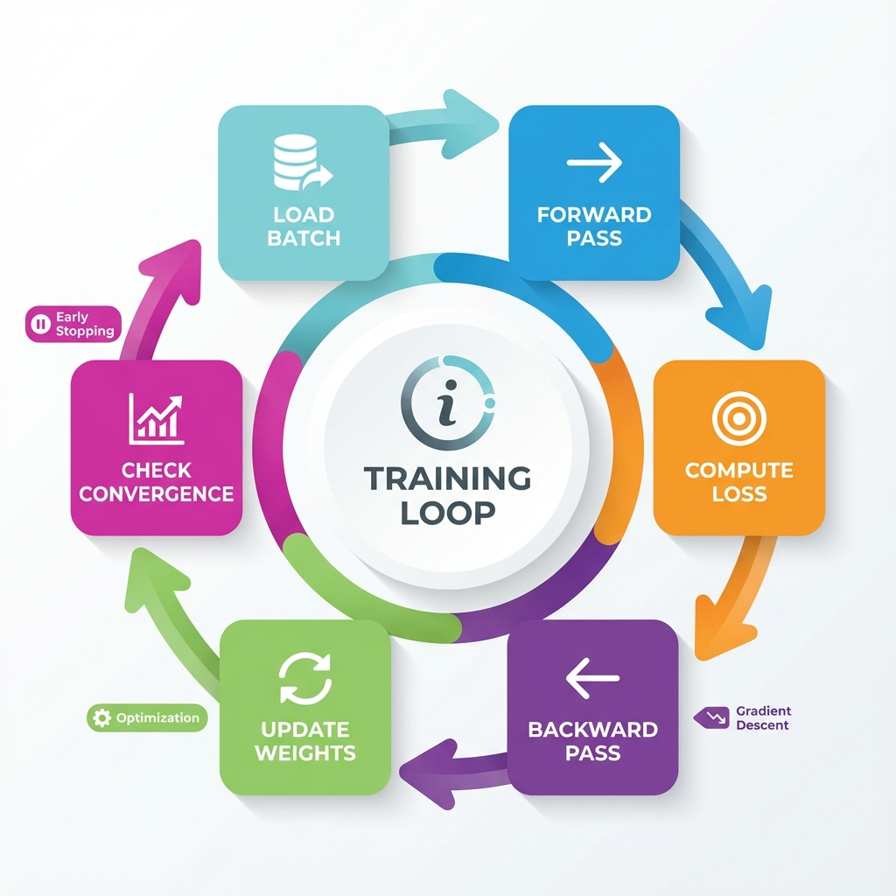
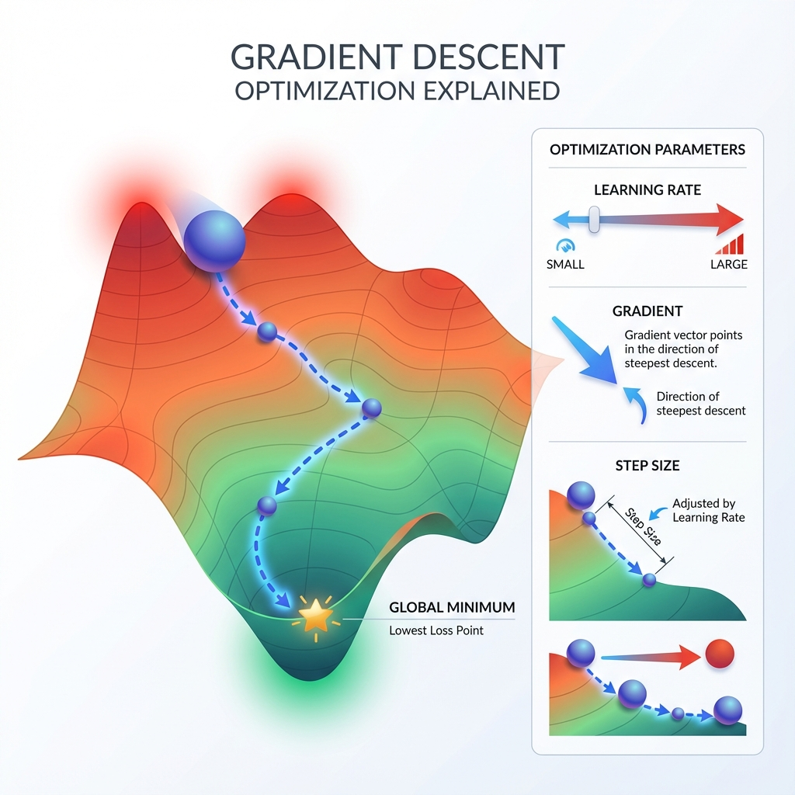
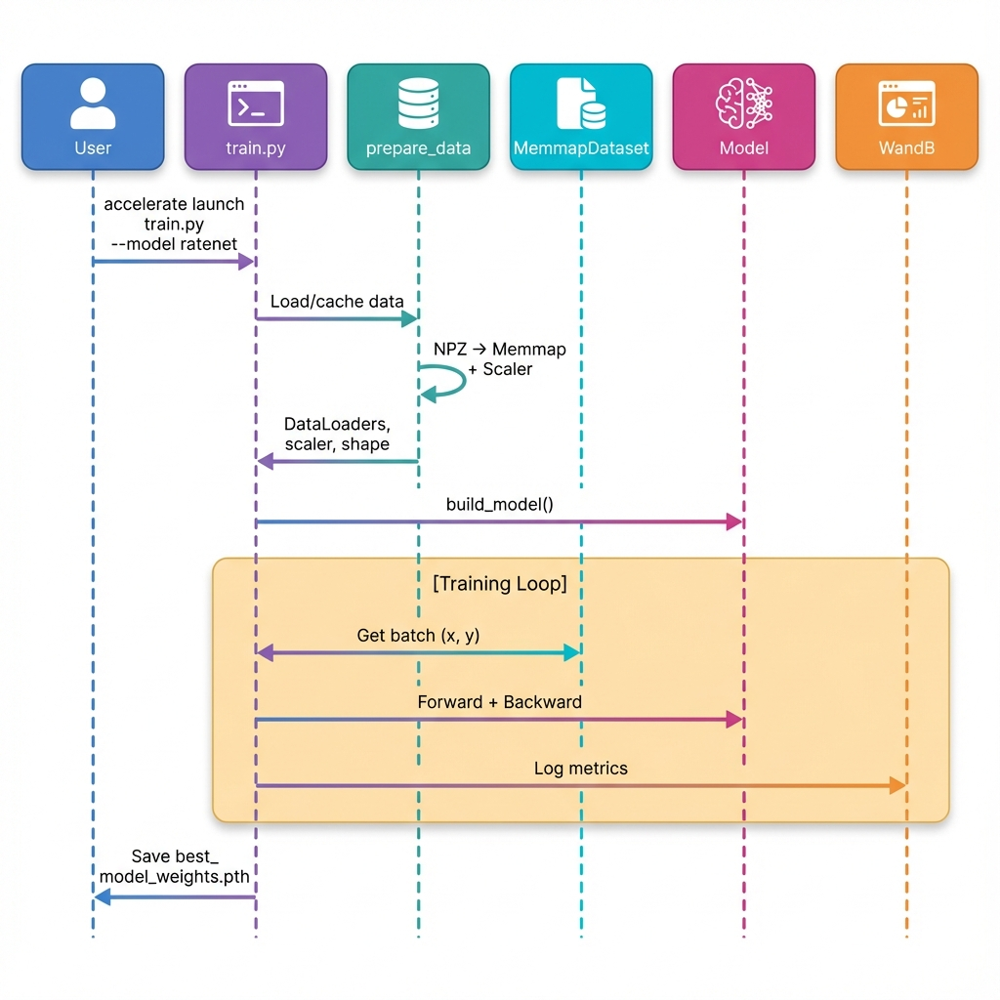
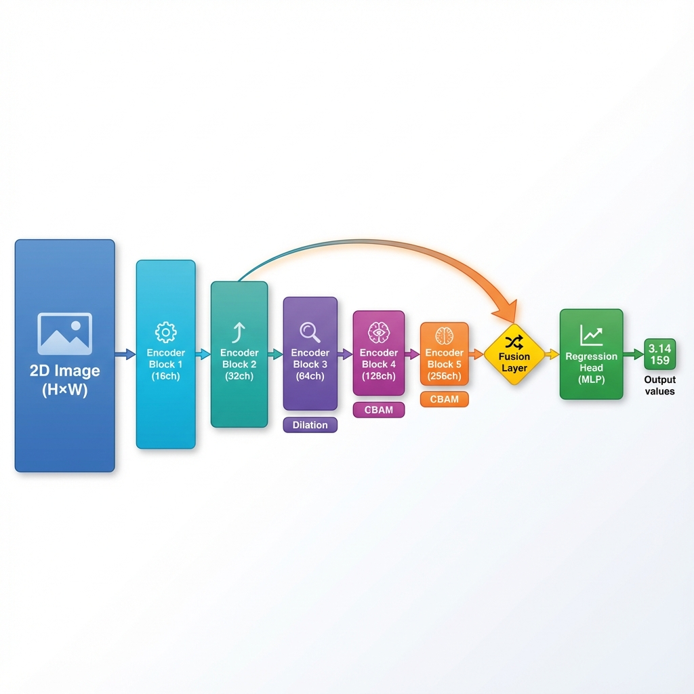
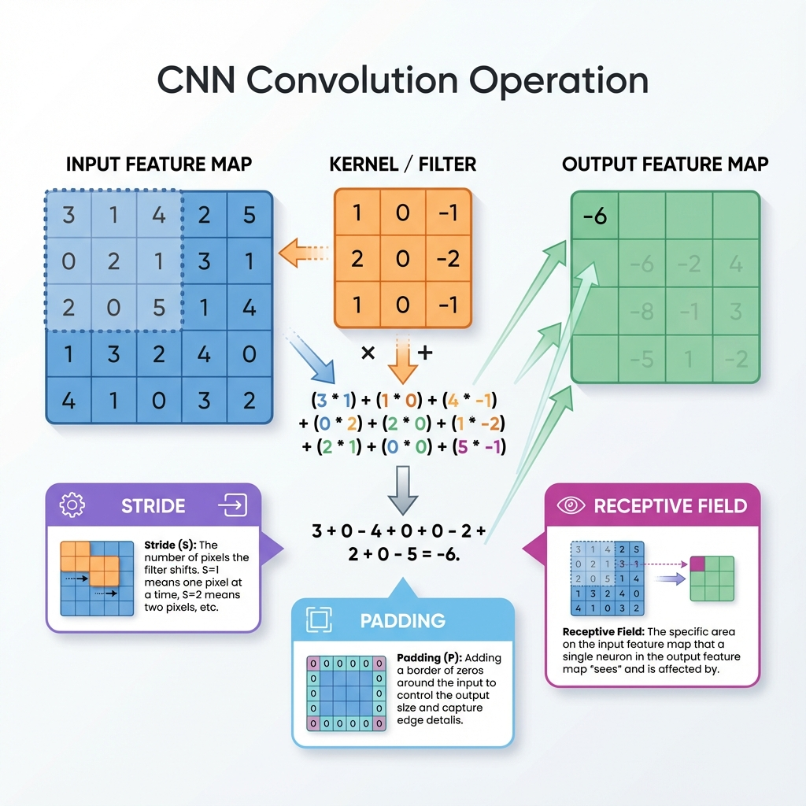
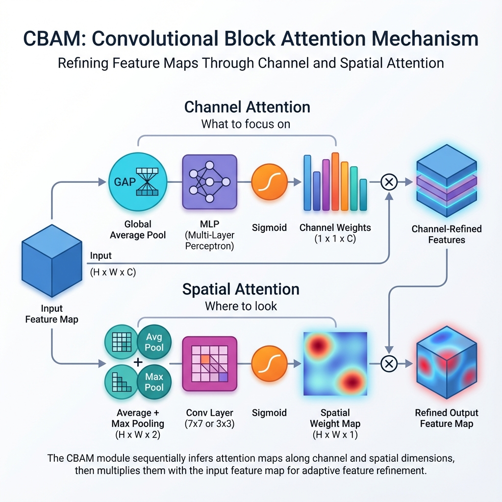
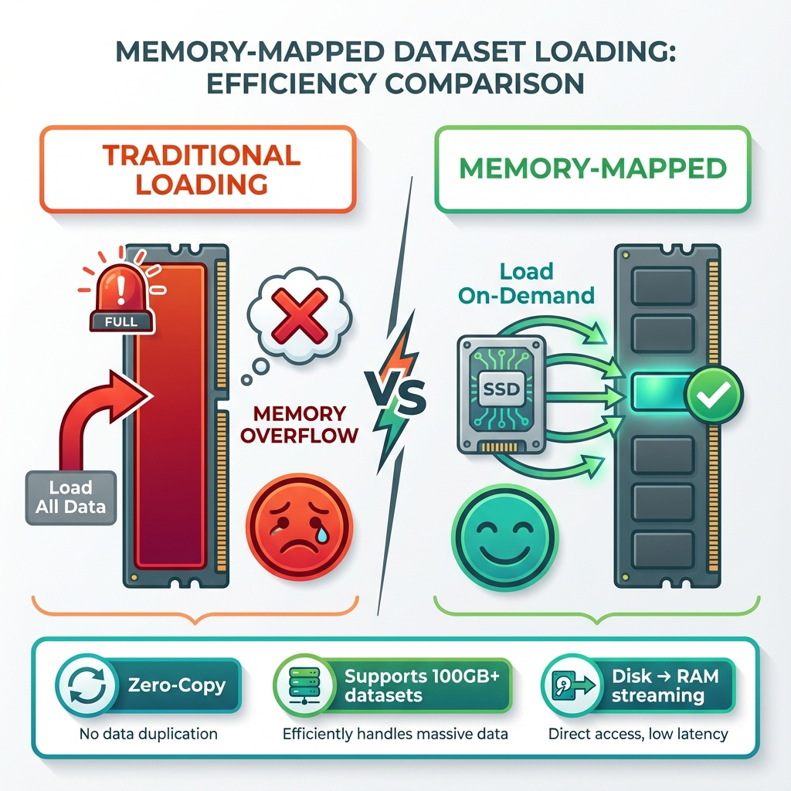

# WaveDL Framework - Complete Beginner's Guide

A comprehensive, beginner-friendly guide to understanding the WaveDL deep learning framework.

---

## 📚 Table of Contents

1. [Deep Learning Foundations](#1-deep-learning-foundations)
2. [What WaveDL Does](#2-what-wavedl-does)
3. [Project Architecture](#3-project-architecture)
4. [The Training Script](#4-the-training-script-trainpy)
5. [Neural Network Models](#5-neural-network-models)
6. [Utility Modules](#6-utility-modules)
7. [Glossary](#7-glossary)

---

## 1. Deep Learning Foundations

Before diving into the code, let's understand the basics.

### 1.1 What is Deep Learning?

**Deep Learning** is teaching computers to learn patterns from data, just like how you learn from examples.

> **💡 Analogy**: Imagine learning to recognize cats. You look at thousands of cat pictures, and your brain learns to identify the patterns (ears, whiskers, fur). Neural networks do the same thing, but with numbers!

### 1.2 Neural Network Structure


A neural network consists of:

| Component | What It Does | Real-World Analogy |
|-----------|--------------|-------------------|
| **Neuron** | Basic computing unit | A single brain cell |
| **Weight** | Connection strength | How strong a memory is |
| **Layer** | Group of neurons | A processing stage |
| **Activation** | Adds non-linearity | Decision threshold |

### 1.3 The Training Loop

Learning happens through repeated cycles of prediction and correction:



**The Training Process:**

1. **Forward Pass**: Data flows through the network → predictions made
2. **Loss Calculation**: Compare predictions to true values → how wrong are we?
3. **Backward Pass**: Calculate gradients (which way to adjust weights)
4. **Weight Update**: Optimizer adjusts weights to reduce loss

> **🔑 Key Insight**: We repeat this process millions of times. Each time, the model gets slightly better!

### 1.4 Gradient Descent (How Learning Works)



Think of it like rolling a ball down a hill:
- The **loss landscape** is the terrain
- Your **model weights** are the ball's position
- **Gradients** show which direction is downhill
- The **learning rate** controls step size
- The **goal** is to reach the lowest point (minimum loss)

### 1.5 Classification vs Regression

| Type | Output | Example |
|------|--------|---------|
| **Classification** | Categories (discrete) | Is this email spam? (Yes/No) |
| **Regression** | Numbers (continuous) | What's the temperature? (23.5°C) |

**WaveDL does regression** - predicting continuous physical values from wave signals.

---

## 2. What WaveDL Does

### 2.1 The Problem We're Solving

**WaveDL** trains neural networks to predict physical properties from ultrasonic guided wave signals.

**Real-World Application:**
- Non-destructive testing of materials
- Measuring thickness, density, elastic properties
- Quality control in manufacturing

### 2.2 Input and Output

| | Description |
|---|-------------|
| **Input** | 2D Wave Image (500 × 500 pixels) |
| **Output** | 5 Physical Properties (thickness, density, velocity, etc.) |

---

## 3. Project Architecture

### 3.1 File Structure


```
WaveDL/
├── train.py              # 🎯 Main entry point
├── models/               # 🧠 Neural network architectures
│   ├── __init__.py       # Package exports
│   ├── registry.py       # Model lookup system
│   ├── base.py           # Template for all models
│   ├── ratenet.py        # RATENet CNN model
│   └── _template.py      # Template for new models
└── utils/                # 🔧 Helper functions
    ├── __init__.py       # Package exports
    ├── data.py           # Data loading
    ├── metrics.py        # Performance measurement
    └── distributed.py    # Multi-GPU helpers
```

### 3.2 Module Responsibilities

| Module | Purpose |
|--------|---------|
| `train.py` | 🎯 Orchestrates entire training process |
| `models/registry.py` | 📋 Model lookup system (factory pattern) |
| `models/base.py` | 📐 Abstract template for all models |
| `models/ratenet.py` | 🧠 The RATENet CNN architecture |
| `utils/data.py` | 💾 Memory-efficient data loading |
| `utils/metrics.py` | 📊 Performance measurements |
| `utils/distributed.py` | 🔗 Multi-GPU coordination |

### 3.3 Complete Data Flow

This diagram shows how everything works together from command to results:


### 3.4 Component Interaction (Sequence Diagram)

This sequence diagram shows how the components communicate during training:



---

## 4. The Training Script (train.py)

### 4.1 Command Line Interface

When you run WaveDL, you can customize everything with flags:

```bash
accelerate launch train.py --model ratenet --batch_size 128 --wandb
```

**All Available Options:**

| Flag | Type | Default | Description |
|------|------|---------|-------------|
| `--model` | string | `ratenet` | Neural network architecture |
| `--batch_size` | int | `128` | Samples per training step |
| `--lr` | float | `0.001` | Learning rate |
| `--epochs` | int | `1000` | Maximum training epochs |
| `--patience` | int | `20` | Early stopping patience |
| `--data_path` | string | `train_data.npz` | Path to dataset |
| `--resume` | string | `None` | Checkpoint to resume from |
| `--compile` | flag | off | Enable torch.compile |
| `--precision` | string | `bf16` | Mixed precision type |
| `--wandb` | flag | off | Enable WandB logging |

### 4.2 What is the Accelerator?

The **Accelerator** (from HuggingFace) simplifies multi-GPU training:
- ✅ Handles device placement automatically
- ✅ Manages mixed precision (FP16/BF16)
- ✅ Coordinates multiple GPUs (DDP)
- ✅ You write normal PyTorch code

> **📝 Note**: DDP (Distributed Data Parallel) means training on multiple GPUs simultaneously. Each GPU gets different data, and results are combined. 4 GPUs = ~4x faster training!

### 4.3 Key Training Concepts

#### Loss Function (Mean Squared Error)

```python
criterion = nn.MSELoss()
```

| Prediction | True Value | Error (Loss) |
|------------|------------|--------------|
| 7 | 5 | (7-5)² = 4 |
| 3 | 4 | (3-4)² = 1 |
| 5 | 5 | (5-5)² = 0 |

> **Lower loss = better predictions!**

#### Optimizer (AdamW)

The optimizer decides HOW to update weights based on gradients.

| Optimizer | Description |
|-----------|-------------|
| **SGD** | Simple, but slow |
| **Adam** | Fast, adaptive learning rates |
| **AdamW** | Adam + proper weight decay (best for most cases) |

#### Learning Rate Scheduler

**ReduceLROnPlateau**: If validation loss doesn't improve for N epochs, reduce learning rate by half. This helps escape local minima.

| Epoch | Learning Rate | What Happened |
|-------|---------------|---------------|
| 1-10 | 0.001 | Normal training |
| 11-20 | 0.0005 | Reduced (stuck for 10 epochs) |
| 21+ | 0.00025 | Reduced again |

#### Early Stopping

Prevents overfitting by stopping when the model stops improving:

| Epoch | Val Loss | Patience Counter | Action |
|-------|----------|------------------|--------|
| 50 | 0.050 | 0 | New best! Reset counter |
| 51 | 0.051 | 1 | Worse, increment |
| 52 | 0.052 | 2 | Worse, increment |
| ... | ... | ... | ... |
| 70 | 0.055 | 20 | **STOP!** (patience=20) |

---

## 5. Neural Network Models

### 5.1 The Registry Pattern

Think of it as a **phone book** for models:

```python
# Register a model
@register_model("ratenet")
class RATENet(BaseModel):
    ...

# Look it up later
model = get_model("ratenet")  # Returns the RATENet class
```

**Why use this?**
- ✅ Add new models without changing train.py
- ✅ Switch models with `--model mymodel` flag
- ✅ Clean separation of concerns

### 5.2 RATENet Architecture

**RATENet** = **R**egression **A**rchitecture for **T**ime-domain **E**valuation **Net**work



### 5.3 Key Architecture Components

#### Convolution Layers

Convolution detects patterns by sliding a small filter across the image:



**What convolution does:**
- Slides a small filter (3×3) across the image
- Detects patterns: edges, textures, shapes
- Early layers → simple patterns (edges)
- Deep layers → complex patterns (objects)

#### Dilated Convolution

| Type | Receptive Field | Computation |
|------|-----------------|-------------|
| Normal (d=1) | 3×3 = 9 pixels | 9 multiplications |
| Dilated (d=2) | 5×5 area | Still 9 multiplications! |
| Dilated (d=4) | 9×9 area | Still 9 multiplications! |

> **💡 Dilated convolution** sees a larger area without more computation. It's like zooming out while keeping the same filter size!

#### CBAM Attention



CBAM applies two types of attention:

1. **Channel Attention**: "Which feature channels are most important?"
2. **Spatial Attention**: "Which spatial locations matter?"

#### Skip Connections

**Why skip connections?**
- ✅ Deep layers lose fine details
- ✅ Skip connections preserve them
- ✅ Combine "what" (deep) with "where" (shallow)

---

## 6. Utility Modules

### 6.1 Data Loading (utils/data.py)

#### The Memory Problem



**Traditional Loading:**
- Load 10GB dataset into RAM
- 💥 Out of memory crash!

**Memory Mapping Solution:**
- Keep data on disk
- Load only what you need, when you need it
- ✅ Works with any dataset size!

> **💡 Analogy**: Memory mapping is like a library. Instead of borrowing all 10,000 books at once, you read one page when you need it!

### 6.2 Distributed Utilities (utils/distributed.py)

**The Problem:** With multiple GPUs, each runs independently. If GPU 0 decides to stop training but others don't know, you get a **deadlock**.

**The Solution:** `broadcast_early_stop()` - GPU 0 broadcasts its decision to all other GPUs so they all stop together.

### 6.3 Metrics (utils/metrics.py)

| Metric | Range | Meaning | Ideal |
|--------|-------|---------|-------|
| **MSE Loss** | 0 → ∞ | Average squared error | Lower is better |
| **MAE** | 0 → ∞ | Average absolute error | Lower is better |
| **R² Score** | -∞ → 1 | Variance explained | 1.0 = perfect |
| **Pearson** | -1 → 1 | Correlation | 1.0 = perfect |

---

## 7. Glossary

### Training Terms

| Term | Definition |
|------|------------|
| **Batch** | Group of samples processed together (e.g., 128 images) |
| **Epoch** | One complete pass through all training data |
| **Forward Pass** | Input → Model → Prediction |
| **Backward Pass** | Calculate gradients for weight updates |
| **Gradient** | Direction and magnitude to adjust weights |
| **Learning Rate** | Step size for weight updates |

### Model Terms

| Term | Definition |
|------|------------|
| **Neuron** | Single computing unit in a neural network |
| **Weight** | Learnable parameter connecting neurons |
| **Layer** | Group of neurons at the same depth |
| **Activation** | Non-linear function (ReLU, LeakyReLU, etc.) |

### Architecture Terms

| Term | Definition |
|------|------------|
| **CNN** | Convolutional Neural Network - specialized for images |
| **Convolution** | Sliding filter that detects patterns |
| **Pooling** | Reduce spatial dimensions (MaxPool, AvgPool) |
| **Skip Connection** | Direct path bypassing layers |
| **Attention** | Mechanism to focus on important parts |

### Distributed Training

| Term | Definition |
|------|------------|
| **DDP** | Distributed Data Parallel - training on multiple GPUs |
| **Rank** | GPU identifier (Rank 0 is the main process) |
| **Mixed Precision** | Using FP16/BF16 to save memory and speed up |

---

## 🚀 Quick Reference

```bash
# Basic training
accelerate launch train.py --model ratenet --wandb

# List available models
python train.py --list_models

# Multi-GPU training
accelerate launch --num_processes=4 train.py --model ratenet --wandb

# Resume training
accelerate launch train.py --model ratenet --resume best_checkpoint

# Full custom configuration
accelerate launch train.py \
    --model ratenet \
    --batch_size 64 \
    --lr 0.0005 \
    --epochs 500 \
    --patience 30 \
    --precision bf16 \
    --compile \
    --wandb \
    --project_name "MyProject"
```

---

*WaveDL Framework Documentation v3.0.0*
