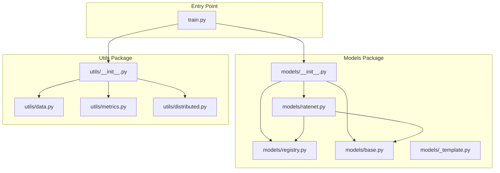
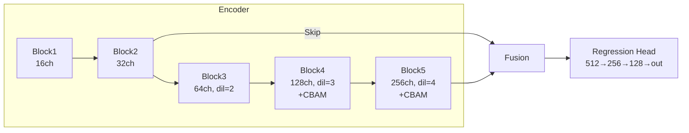
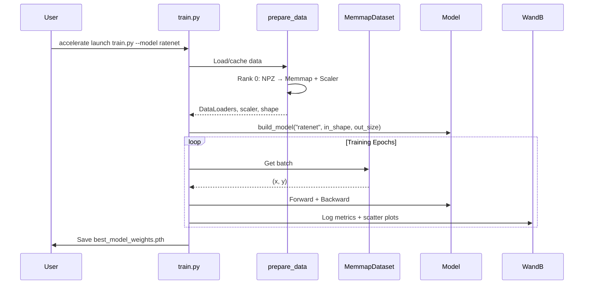

# WaveDL Framework - Complete Code Walkthrough

A deep learning framework optimized for **Ultrasonic Guided Wave Inversion** tasks, designed for HPC multi-GPU training.

---

## Architecture Overview



---

## 1. Main Training Script

### [train.py](file:///Users/ductho/Library/CloudStorage/Dropbox/04%20CODE/GitHub/WaveDL/train.py)

The main entry point - a 494-line DDP training script.

#### Key Responsibilities:
| Section | Lines | Purpose |
|---------|-------|---------|
| CLI Args | 83-128 | Parse model, hyperparams, data paths |
| System Init | 145-178 | Accelerator, logging, WandB setup |
| Data & Model | 180-216 | Load data, build model, optimizer |
| Resume Logic | 220-249 | Checkpoint restoration |
| Training Loop | 270-472 | Epoch iteration with validation |

#### Core Training Flow:
```python
# 1. Initialize Accelerator for DDP + mixed precision
accelerator = Accelerator(mixed_precision=args.precision)

# 2. Load data with prepare_data() utility
train_dl, val_dl, scaler, in_shape, out_dim = prepare_data(args, logger, accelerator)

# 3. Build model from registry
model = build_model(args.model, in_shape=in_shape, out_size=out_dim)

# 4. DDP preparation
model, optimizer, train_dl, val_dl, scheduler = accelerator.prepare(...)

# 5. Training loop with:
#    - Gradient accumulation
#    - Physical MAE tracking (unscaled metrics)
#    - DDP-safe early stopping via broadcast_early_stop()
#    - Periodic checkpointing
```

#### Notable Features:
- **Physical MAE**: Converts normalized predictions back to physical units using `scaler.scale_`
- **DDP-Safe Early Stopping**: Uses `broadcast_early_stop()` to synchronize stop decision across GPUs
- **Resume Training**: Restores epoch, best_val_loss, patience counter from checkpoint

---

## 2. Model Registry System

### [models/registry.py](file:///Users/ductho/Library/CloudStorage/Dropbox/04%20CODE/GitHub/WaveDL/models/registry.py)

A **factory pattern** for dynamic model selection via CLI.

```python
MODEL_REGISTRY: Dict[str, Type[nn.Module]] = {}  # Global registry

@register_model("ratenet")  # Decorator adds to registry
class RATENet(BaseModel):
    ...

# Usage
model = build_model("ratenet", in_shape=(500, 500), out_size=5)
```

| Function | Purpose |
|----------|---------|
| `@register_model(name)` | Decorator to register a model class |
| `get_model(name)` | Retrieve model class by name |
| `list_models()` | List all registered model names |
| `build_model(name, ...)` | Instantiate model with args |

---

### [models/base.py](file:///Users/ductho/Library/CloudStorage/Dropbox/04%20CODE/GitHub/WaveDL/models/base.py)

**Abstract base class** that all models must inherit from.

```python
class BaseModel(nn.Module, ABC):
    @abstractmethod
    def __init__(self, in_shape: Tuple[int, int], out_size: int, **kwargs):
        ...
    
    @abstractmethod
    def forward(self, x: torch.Tensor) -> torch.Tensor:
        ...
    
    def get_optimizer_groups(self, base_lr, weight_decay):
        # No weight decay on bias/normalization layers
        ...
    
    def parameter_summary(self) -> Dict:
        # Returns total/trainable params, model size in MB
        ...
```

> [!IMPORTANT]
> All custom models **must** inherit from `BaseModel` and implement `__init__` and `forward`.

---

### [models/ratenet.py](file:///Users/ductho/Library/CloudStorage/Dropbox/04%20CODE/GitHub/WaveDL/models/ratenet.py)

**RATENet**: Regression Architecture for Time-domain Evaluation Network.

#### Architecture:


#### Key Components:

| Component | Description |
|-----------|-------------|
| **CBAM** | Channel + Spatial attention module |
| **Dilated Conv** | Increasing dilation rates (1→2→3→4) for multi-scale features |
| **Skip Connection** | Block2 → Block5 fusion for multi-resolution info |
| **GroupNorm** | DDP-friendly normalization (vs BatchNorm) |

```python
# CBAM Attention
x = x * self.channel_attention(x)  # Channel-wise weighting
x = x * self.spatial_attention(...)  # Spatial-wise weighting

# Skip connection
x2_upsampled = F.interpolate(x2, size=x5.shape[2:], mode='bilinear')
fused = torch.cat([x5, x2_upsampled], dim=1)
```

---

### [models/_template.py](file:///Users/ductho/Library/CloudStorage/Dropbox/04%20CODE/GitHub/WaveDL/models/_template.py)

A **template file** for adding new models. Copy and modify this file.

```python
# Steps to add new model:
# 1. Copy this file to models/your_model.py
# 2. Rename class, update @register_model("your_model")
# 3. Implement __init__ and forward
# 4. Import in models/__init__.py
# 5. Run: accelerate launch train.py --model your_model
```

---

## 3. Utility Modules

### [utils/data.py](file:///Users/ductho/Library/CloudStorage/Dropbox/04%20CODE/GitHub/WaveDL/utils/data.py)

Handles **memory-efficient data loading** for large datasets.

#### MemmapDataset

Zero-copy dataset using numpy memory mapping:

```python
class MemmapDataset(Dataset):
    def __getitem__(self, idx):
        if self.data is None:
            # Lazy init: each worker opens its own file handle
            self.data = np.memmap(self.memmap_path, dtype='float32', mode='r', shape=self.shape)
        
        real_idx = self.indices[idx]
        x = torch.from_numpy(self.data[real_idx].copy())  # .copy() detaches from mmap
        return x, self.targets[real_idx]
```

#### prepare_data()

Two-phase data preparation with DDP synchronization:

| Phase | Rank | Actions |
|-------|------|---------|
| **Phase 1** | Rank 0 only | Load NPZ → Create memmap cache → Fit scaler |
| **Phase 2** | All ranks | Wait → Load metadata/scaler → Create DataLoaders |

```python
with accelerator.main_process_first():  # Rank 0 does prep
    if not cache_exists:
        # Create memmap, fit scaler...
        
accelerator.wait_for_everyone()  # Sync barrier
# All ranks load from cache...
```

---

### [utils/distributed.py](file:///Users/ductho/Library/CloudStorage/Dropbox/04%20CODE/GitHub/WaveDL/utils/distributed.py)

**DDP-safe utilities** for multi-GPU synchronization.

| Function | Purpose |
|----------|---------|
| `broadcast_early_stop(should_stop, accelerator)` | Sync early stopping decision from rank 0 |
| `broadcast_value(value, accelerator)` | Broadcast scalar from rank 0 |
| `sync_tensor(tensor, accelerator, reduction)` | Reduce tensor across ranks |

```python
# Example: DDP-safe early stopping
should_stop = patience_ctr >= patience if accelerator.is_main_process else False
if broadcast_early_stop(should_stop, accelerator):
    break  # All ranks exit together
```

> [!WARNING]
> Without `broadcast_early_stop()`, only rank 0 would exit, causing a **deadlock**.

---

### [utils/metrics.py](file:///Users/ductho/Library/CloudStorage/Dropbox/04%20CODE/GitHub/WaveDL/utils/metrics.py)

**Scientific metrics** and visualization tools.

#### MetricTracker

Running average tracker for batch metrics:

```python
tracker = MetricTracker()
for batch in dataloader:
    tracker.update(loss.item(), n=batch_size)
print(f"Avg loss: {tracker.avg}")
```

#### Statistical Functions

| Function | Description |
|----------|-------------|
| `calc_pearson(y_true, y_pred)` | Average Pearson correlation across targets |
| `calc_per_target_r2(y_true, y_pred)` | R² score for each target independently |
| `get_lr(optimizer)` | Extract current learning rate |

#### Visualization

`plot_scientific_scatter()` creates publication-quality scatter plots:


---

## 4. Data Flow Summary



---

## 5. Usage Examples

```bash
# Basic training
accelerate launch train.py --model ratenet --wandb --batch_size 128

# Multi-GPU with explicit config
accelerate launch --num_processes=4 --main_process_port=29500 \
    train.py --model ratenet --wandb --project_name "WaveInversion"

# Resume from checkpoint
accelerate launch train.py --model ratenet --resume best_checkpoint --wandb

# List available models
python train.py --list_models
```

---

## 6. File Summary

| File | Lines | Purpose |
|------|-------|---------|
| `train.py` | 494 | Main DDP training script |
| `models/__init__.py` | 62 | Package exports |
| `models/registry.py` | 99 | Model factory pattern |
| `models/base.py` | 146 | Abstract base class |
| `models/ratenet.py` | 260 | RATENet architecture |
| `models/_template.py` | 162 | Template for new models |
| `utils/__init__.py` | 47 | Package exports |
| `utils/data.py` | 315 | Memmap dataset + data prep |
| `utils/distributed.py` | 142 | DDP synchronization utils |
| `utils/metrics.py` | 278 | Metrics + visualization |

**Total: ~2,005 lines of code**
